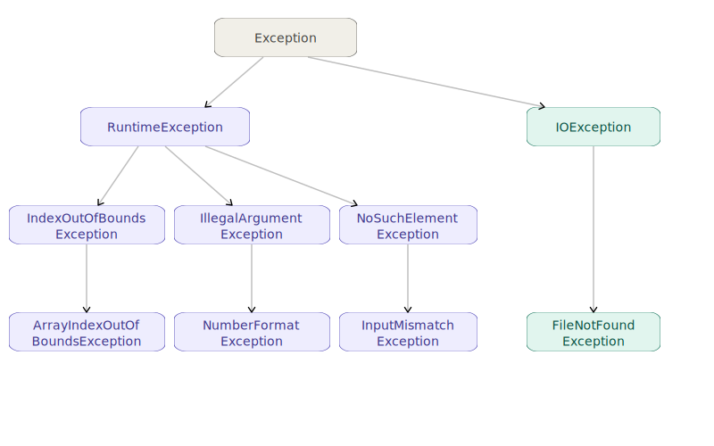

# Exceptions

## What is an exception?

When something goes wrong at runtime, for example:
- the file you are trying to open doesn't exist
- the string you are parsing as an int can't be parsed (e.g `"dasad21dsa"`)
- you read past the end of an array (e.g array has 2 elements in total but you've written `arr[10]`)
Java stops what it's doing and **throws an exception**. An exception is an object that describes what went wrong. If you don't catch it, the program crashes.

---

## Checked vs unchecked

Java has two types of exception:

**Unchecked:** Tthe compiler doesn't force you to handle them. They can happen anywhere. Examples: `ArrayIndexOutOfBoundsException`, `NumberFormatException`, `InputMismatchException`, `NoSuchElementException`.

**Checked:** The compiler *does* force you to handle them. If you call code that can throw one, you must either catch it or declare `throws` on your method. Example: `FileNotFoundException`.

For now, the practical difference is: if the compiler complains that an exception is "unhandled", it's a checked exception. The easiest fix is to add `throws IOException` to your `main` signature and move on.

```java
public static void main(String[] args) throws Exception {
    // compiler is now satisfied - if something throws, Java prints it and stops
}
```


## Try/catch

To handle an exception yourself instead of letting the program crash, wrap the risky code in a `try` block and catch the exception:

```java
try {
    int n = Integer.parseInt("abc"); // this will throw
    System.out.println(n);           // this line is never reached
} catch (NumberFormatException e) {
    System.out.println("That wasn't a number!");
}
```

- The `try` block contains the code that might throw.
- The `catch` block runs only if that specific exception is thrown.
- `e` is the exception object - you can call `e.getMessage()` to get a description.

You can chain multiple `catch` blocks to handle different exceptions separately:

```java
try {
    Scanner sc = new Scanner(new File(filename));
    int n = sc.nextInt();
} catch (FileNotFoundException e) {
    System.out.println("File not found: " + filename);
} catch (InputMismatchException e) {
    System.out.println("File didn't contain an integer.");
}
```


In the above case, if we are being lazy, we can also just say `catch (Exception e)`, that'll catch all types of exceptions.
```java
try {
    Scanner sc = new Scanner(new File(filename));
    int n = sc.nextInt();
} catch (Exception e) {
    System.out.println("Sumting wong.");
}
```
In this example, `Exception e` is good enough to catch both `FileNotFoundException` and `InputMismatchException`

The upside of this, is it's practical for smaller projects: You don't have to list out every single type of exception that can be thrown by the `try` block's code.

Downside is, this is a "catch all" approach, when we catch something, it'll be harder to tell exactly what went wrong. In the above example, we don't know whether the file isn't found, or whether the the file existed, but it didn't contain an integer. Either case we'd say something like "We couldn't read an integer from a scanner".

#### Note: `catch (Exception e)` will catch all types of exceptions

This works because exceptions have an hierarchy, and `Exception` sits on top of it. Every exception is a "sub type" of `Exception` class.

E.g. in the above example, if we tried to catch, say some irrelevant exception like `IndexOutOfBoundsException`, that wouldn't work, because `IndexOutOfBoundsException` isn't a parent of either `FileNotFoundException` or `InputMismatchException`



---

## Finally

A `finally` block runs **no matter what** — whether the `try` succeeded or an exception was caught. It's the right place for cleanup code like closing a scanner:

```java
Scanner sc = new Scanner("10 20");
try {
    int a = sc.nextInt();
    int b = sc.nextInt();
    System.out.println("Sum: " + (a + b));
} catch (NoSuchElementException e) {
    System.out.println("Not enough numbers in input.");
} finally {
    sc.close(); // always runs
}
```

---

## Some exceptions we might hit in our exercises:

| Exception | When it's thrown |
|---|---|
| `NumberFormatException` | `Integer.parseInt("abc")` string isn't a number |
| `InputMismatchException` | `sc.nextInt()` finds a non-integer token |
| `NoSuchElementException` | `sc.nextInt()` called when there's nothing left |
| `FileNotFoundException` | `new Scanner(new File(...))` file doesn't exist |

---

## The lazy but practical approach

It's good to know about exceptions, and how to handle them, but for learning exercises, it's fine to not catch every exception granularly.
